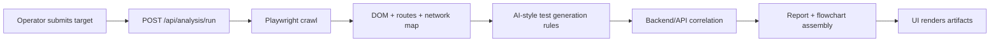

# SK CrawlPulse

AI-powered autonomous testing platform prototype for crawling websites, generating test cases, validating backend alignment, and producing report-ready artifacts.

## Architecture

### System layers

1. Operator UI (`frontend`)
   - Accepts a frontend URL and optional backend metadata.
   - Triggers analysis runs and displays the generated QA artifacts.
2. Analysis API (`backend`)
   - Orchestrates crawl, test generation, backend validation, and report assembly.
3. Frontend analysis engine
   - Uses Playwright to crawl same-origin pages, inspect DOM structure, and map interaction paths.
4. QA intelligence layer
   - Converts crawl findings into functional, negative, boundary, edge, and UX test cases.
5. Backend validation layer
   - Correlates observed frontend network traffic with provided backend ownership signals.
6. Reporting layer
   - Produces structured JSON outputs and a PDF-ready report outline.

### Request lifecycle



## Folder structure

```text
sk-crawlpulse/
  backend/
    src/
      config/           runtime configuration
      lib/              reusable error primitives
      middleware/       express error handling
      modules/
        backend/        API validation logic
        frontend/       crawler and test generation
        platform/       analysis orchestration
        reporting/      report and flowchart builders
      routes/           HTTP endpoints
      types/            platform-wide contracts
      utils/            URL normalization helpers
  frontend/
    src/
      App.tsx           operator console
      index.css         global design system
  docs/
    examples/          sample result artifacts
```

## Key modules

- `crawlFrontend`: discovers pages, links, forms, inputs, and observed network traffic.
- `generateTestCases`: translates crawl findings into structured QA cases.
- `validateBackendInput`: aligns frontend API usage with optional backend ownership input.
- `buildReport`: emits report sections and Mermaid flowchart output.
- `runPlatformAnalysis`: orchestration boundary for current and future execution engines.

## Starter modules requested

- Website crawler: `backend/src/modules/frontend/crawler.ts`
- Test generator: `backend/src/modules/frontend/testGenerator.ts`
- API validator: `backend/src/modules/backend/apiValidator.ts`

## Example test case format

```json
{
  "testId": "FT-1-001",
  "category": "functional",
  "priority": "P1",
  "title": "Page renders successfully for /login",
  "description": "Validate that Login loads with the expected primary content and basic interactions.",
  "steps": [
    "Open https://example.com/login",
    "Wait for the document ready state to complete",
    "Verify at least one heading is visible: Welcome back"
  ],
  "expectedResult": "The page loads without console-breaking UI issues and the expected content is visible.",
  "sourcePage": "https://example.com/login"
}
```

## Report outputs

- JSON result: full analysis payload returned by `POST /api/analysis/run`
- PDF structure: report outline exposed in the `report.pdfOutline` field and documented in `docs/examples/report-pdf-outline.md`

## Next implementation milestones

1. Persist runs and artifacts in PostgreSQL or MongoDB.
2. Add authenticated crawling and deeper interaction replay.
3. Execute generated tests and store pass/fail evidence with screenshots.
4. Add load testing workers and PDF export pipeline.
